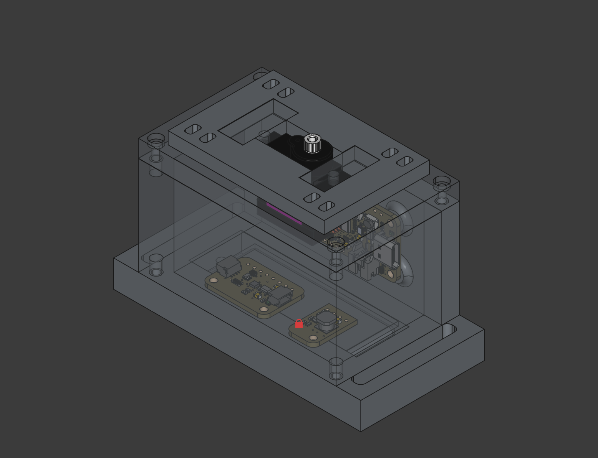

# barodrop
A battery-powered, barometer-driven release system that automatically drops a payload at a configurable target altitude.

## Why?
I've been participating in the Hungarian CanSat competition for two years. In my time working on the model satellite, we launched prototypes 4 times on high altitude weather balloons for testing. A key piece in these tests is the release system: it drops the CanSat before it flies too far away, making recovery marginally more difficult. However, the release system was always a pain point. Difficult to set up, integrate into existing systems' code or unreliable.

I decided to build something that solves all of these problems:

- independent electronics, keeping complexity low
- separate power supply: no battery drain
- reliability: built around a "drop plate" design
- easy setup, effortless configuration, solid construction

## Usage
Using barodrop is easy. Here's how it's done:

1. Write your desired configuration (altitude, timeout) to a microSD card and insert it into the main board.
2. Hold the flyaway part in place in order for the servo to lock it in place.
3. Plug in the battery to power on the system while holding the flyaway part.
4. Screw in the side panel.
5. You are ready to launch!

## Assembly
So you want one of these for yourself? The following guide will walk you through building it step-by-step.

### 1. Components
You'll have to source some components to build barodrop. You can find everything needed in the table below. I included the links for where I got the components.

| Component                         | Description     | Link                                                                       |
|-----------------------------------|-----------------|----------------------------------------------------------------------------|
| Adafruit Feather RP2040 Adalogger | main board      | [Mouser](https://mou.sr/4baPHUJ)                                           |
| Adafruit BMP390                   | barometer       | [Mouser](https://mou.sr/4uvOA9I)                                           |
| Adafruit MiniBoost 5V             | booster         | [Mouser](https://mou.sr/4diH9MU)                                           |
| Tower Pro MG90S                   | servo motor     | [HESTORE](https://www.hestore.hu/prod_10048104.html#)                      |
| JST PH 2-pin cable                | battery cable   | [Mouser](https://mou.sr/4luIpPd)                                           |
| CNC Kitchen M2x3                  | threaded insert | [3DJake](https://www.3djake.com/cnc-kitchen/threaded-inserts-m2-standard)  |
| CNC Kitchen M2.5x4                | threaded insert | [3DJake](https://www.3djake.com/cnc-kitchen/threaded-inserts-m25-standard) |
| cylinder head M2, M2.5            | screws          | locally sourced / [Amazon](https://www.amazon.de/-/en/FandWay-Cylinder-Hexagon-Threaded-Stainless/dp/B0F3HJHFFS?th=1)                                                              |
| Dupont Wires                      | jumper wires    | locally sourced / [Amazon](https://www.amazon.de/-/en/Elegoo-120pcs-Multicolored-Breadboard-arduino/dp/B01EV70C78?s=industrial&th=1)                                                 |

>| Any screws (with the correct sizes) and any wires you have lying around the house will do. If you do not have any, chances are you can find these at your local hardware store. I included some Amazon links for reference.

>| You can find a [more detailed BOM](https://github.com/4f48/barodrop/blob/main/BOM.csv) in the repository files.

To complete the build, you need to 3D print some parts. If you do not own a 3D printer, try a print-on-demand service. Additionally, a soldering iron with a threaded insert adapter, some solder and very basic soldering skills are needed.

### 2. Print the enclosure
Get started by 3D printing the enclosure. I recommend using PETG.

STL files: [/STL](https://github.com/4f48/barodrop/tree/main/STL)  
STEP files: [/STEP](https://github.com/4f48/barodrop/tree/main/STEP)

Print each file once. The "flyaway" part needs to be reprinted with each use, since it flies away with the balloon on release.

### 3. Insert the threads
To be able to screw the different components together, you need to install threaded inserts into the 3D printed parts.

- 2x M2 threaded inserts go into the top enclosure's bottom, near the hole in the middle.
- 1x M2 threaded insert goes into battery holder
- Populate the rest of the holes with M2.5 inserts.

### 4. Solder the components

Follow this wiring diagram to connect the components together. You might need to cut off a plug from the end of the servo's wires.

The battery comes with an incompatible connector from the factory. Cut it off, and solder on the 2-pin JST PH cable. Keep polarity in mind.

### 5. Load firmware
Firstly, download the CircuitPython UF2 from [circuitpython.org](https://circuitpython.org/board/adafruit_feather_rp2040_adalogger/). To enter the bootloader, hold down the "Boot" button, and while continuing to hold it, press and release the "Reset" button. Keep holding the "Boot" button until the RPI-RP2 drive appears. Copy the downloaded file to the RPI-RP2 drive. The RPI-RP2 drive will disappear and a new disk drive called CIRCUITPY will appear.

Next, download the CircuitPython library bundle for version 10.x from [circuitpython.org](https://circuitpython.org/libraries). Unzip the downloaded file and copy "adafruit_bmp3xx.mpy" from the "lib" directory to the CIRCUITPY drive's "lib" directory. 

Finally, download [code.py](https://github.com/4f48/barodrop/blob/main/code.py) from this repository, and replace the contents of the "code.py" file already on the CIRCUITPY drive with the downloaded file's.

To ensure the new firmware is loaded correctly, press the "Reset" button on the board.

### 6. Assembly
You are almost done, we just need to put everything together. Start by placing the battery in the bottom enclosure. Cover it with the battery holder, and screw in the battery holder from the bottom. Next, mount the main board, the barometer and the booster to the bottom enclosure.

Use two M2 screws to attach the servo motor to the top enclosure. Secure the top enclosure to the bottom enclosure. Finally, screw in the side panel using two screws on the top and bottom. If you intend to power on the circuit, plug in the battery cable before screwing in the side panel.

## Bill of Materials

Download as CSV: [BOM.csv](https://github.com/4f48/barodrop/blob/main/BOM.csv)  
Download as OpenDocument Spreadsheet: [BOM.ods](https://github.com/4f48/barodrop/raw/refs/heads/main/BOM.ods)

| Component                         | Description     | Link                                                                       |
|-----------------------------------|-----------------|----------------------------------------------------------------------------|
| Adafruit Feather RP2040 Adalogger | main board      | [Mouser](https://mou.sr/4baPHUJ)                                           |
| Adafruit BMP390                   | barometer       | [Mouser](https://mou.sr/4uvOA9I)                                           |
| Adafruit MiniBoost 5V             | booster         | [Mouser](https://mou.sr/4diH9MU)                                           |
| Tower Pro MG90S                   | servo motor     | [HESTORE](https://www.hestore.hu/prod_10048104.html#)                      |
| JST PH 2-pin cable                | battery cable   | [Mouser](https://mou.sr/4luIpPd)                                           |
| CNC Kitchen M2x3                  | threaded insert | [3DJake](https://www.3djake.com/cnc-kitchen/threaded-inserts-m2-standard)  |
| CNC Kitchen M2.5x4                | threaded insert | [3DJake](https://www.3djake.com/cnc-kitchen/threaded-inserts-m25-standard) |
| cylinder head M2, M2.5            | screws          | locally sourced / [Amazon](https://www.amazon.de/-/en/FandWay-Cylinder-Hexagon-Threaded-Stainless/dp/B0F3HJHFFS?th=1)                                                              |
| Dupont Wires                      | jumper wires    | locally sourced / [Amazon](https://www.amazon.de/-/en/Elegoo-120pcs-Multicolored-Breadboard-arduino/dp/B01EV70C78?s=industrial&th=1)                                                 |

>| Any screws (with the correct sizes) and any wires you have lying around the house will do. If you do not have any, chances are you can find these at your local hardware store. I included some Amazon links for reference.